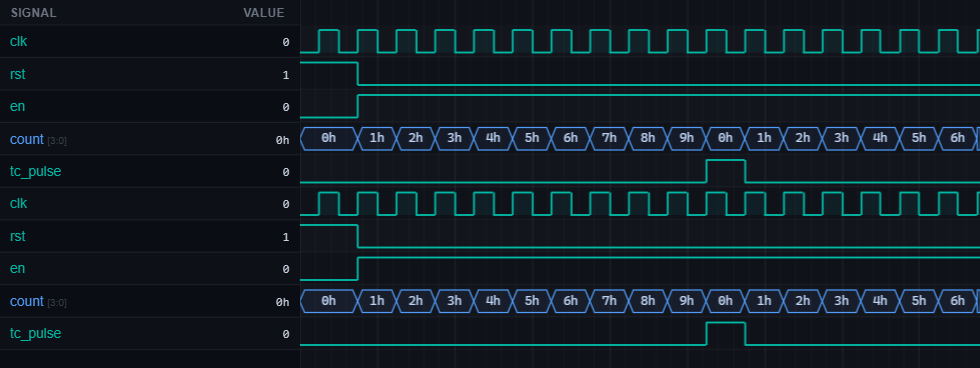

# [rtl-debug-counter-termcount] 4. Counter — Terminal Count Glitch

| Property | Value |
|----------|-------|
| **Language** | SystemVerilog |
| **Solved** | April 8, 2026 |
| **Platform** | [LeetSilicon](https://leetsilicon.com/?view=question&question=rtl-debug-counter-termcount) |

## Problem Description

### Problem Statement

Terminal-count pulse is generated from the current count and appears one cycle late for a mod-10 counter. Use the Simulate Code tab with waveforms/logs to identify and fix the RTL issue.

### Requirements

- Use the Simulate Code tab and inspect the provided buggy RTL + waveform signals.

- Identify the root cause (not just the symptom) and implement a fix in design.sv.

- Expected Behavior: tc_pulse should assert exactly when count transitions from 9 back to 0.

- Expected Behavior: Pulse width should be one cycle only.

- Expected Behavior: Counter should restart cleanly after reset.

## Simulation Results

| Metric | Value |
|--------|-------|
| **Status** | ✅ Passed |
| **Lint Warnings** | 0 |

## Waveforms

---
*Auto-synced by [SiliconHub](https://github.com) · April 8, 2026*
