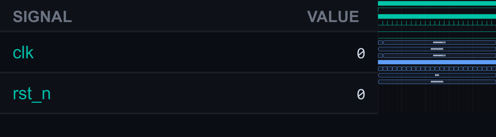

# [rtl9] 37. Generate Second/Minute/Hour Pulses from 1 ms Tick

| Property | Value |
|----------|-------|
| **Difficulty** | Easy |
| **Category** | RTL |
| **Language** | SystemVerilog |
| **Solved** | April 29, 2026 |
| **Platform** | [LeetSilicon](https://leetsilicon.com/?view=question&question=rtl9) |

## Constraints

Use counters driven by a 1 ms pulse to generate derived timebase pulses.Conversion: 1000 ticks → sec, 60 sec → min, 60 min → hrConstraints:Each pulse is 1 cycle wide at rolloverCascaded counters

## Simulation Results

| Metric | Value |
|--------|-------|
| **Status** | ✅ Passed |
| **Lint Warnings** | 0 |

## Waveforms

---
*Auto-synced by [SiliconHub](https://github.com) · April 29, 2026*
