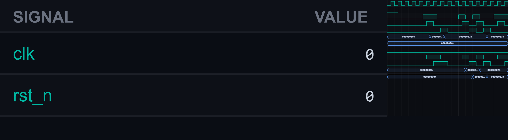

# [misc1] 46. Implement Rising and Falling Edge Detector

| Property | Value |
|----------|-------|
| **Difficulty** | Easy |
| **Language** | SystemVerilog |
| **Solved** | May 1, 2026 |
| **Platform** | [LeetSilicon](https://leetsilicon.com/?view=question&question=misc1) |

## Problem Description

Verilatorscale 1psend 170100%WaveformConsoleSignalValueclk0rst_n0
        @keyframes wv-spin { to { transform: rotate(360deg); } }
        .wv-sig-list { scrollbar-width: thin; scrollbar-color: #2a3140 transparent; }
        .wv-sig-list::-webkit-scrollbar { width: 8px; }
        .wv-sig-list::-webkit-scrollbar-track { background: transparent; }
        .wv-sig-list::-webkit-scrollbar-thumb { background: #1f2530; border-radius: 4px; }
        .wv-sig-list::-webkit-scrollbar-thumb:hover { background: #2a3140; }
      46. Implement Rising and Falling Edge DetectorEasyEdge DetectionSequentialDesignDesign an edge detector generating single-cycle pulses on rising (0→1) and falling (1→0) transitions.Logic:rise_pulse = sig_in & ~sig_prev
fall_pulse = ~sig_in & sig_prevConstraints:Single-cycle pulse per detectionNo re-triggering while input holds steadyReset: sig_prev = 0Example 1Test Case 1 - Rising Edge: sig_in sequence: 0, 0, 1, 1, 1. Expected: rise_pulse=1 at cycle 2 (transition 0→1). rise_pulse=0 at cycles 0,1,3,4.Example 2Test Case 2 - Falling Edge: sig_in sequence: 1, 1, 0, 0, 0. Expected: fall_pulse=1 at cycle 2 (transition 1→0). fall_pulse=0 at cycles 0,1,3,4.Example 3Test Case 3 - Multiple Edges: sig_in sequence: 0, 1, 0, 1, 0. Expected: rise_pulse at cycles 1,3. fall_pulse at cycles 2,4.Example 4Test Case 4 - No Edges: sig_in holds 0 for 5 cycles, then holds 1 for 5 cycles. Expected: rise_pulse=1 at transition cycle only. No repeated pulses.Example 5Test Case 5 - Reset: Assert reset with sig_in=1. Expected: sig_prev=0 after reset. If sig_in remains 1, next cycle: rise_pulse=1 (detects 0→1 transition from reset state).ConstraintsINPUT: Signal to monitor for edges "sig_in" (1 bit).OUTPUTS: (1) rise_pulse (1 bit): Pulses high for one cycle on rising edge, (2) fall_pulse (1 bit): Pulses high for one cycle on falling edge.RISING EDGE DETECTION: Rising edge occurs when signal transitions from 0 to 1. Detect by comparing current value with previous (sampled last cycle). Condition: sig_in=1 AND sig_prev=0.FALLING EDGE DETECTION: Falling edge occurs when signal transitions from 1 to 0. Condition: sig_in=0 AND sig_prev=1.PREVIOUS SAMPLE REGISTER: Maintain register "sig_prev" storing value of sig_in from previous clock cycle. Updated every cycle.SINGLE-CYCLE PULSE: Edge pulses asserted for exactly one clock cycle on detection, then deassert (even if input remains at new value).NO RE-TRIGGERING: If input holds high or low, no repeated pulses. Only transitions generate pulses.RESET: On reset, initialize sig_prev to known value (typically 0). No pulses generated at reset.

## Constraints

Design an edge detector generating single-cycle pulses on rising (0→1) and falling (1→0) transitions.Logic:rise_pulse = sig_in & ~sig_prev
fall_pulse = ~sig_in & sig_prevConstraints:Single-cycle pulse per detectionNo re-triggering while input holds steadyReset: sig_prev = 0

## Simulation Results

| Metric | Value |
|--------|-------|
| **Status** | ✅ Passed |
| **Tests** | 4 passed, 0 failed |
| **Lint Warnings** | 0 |

## Waveforms

---
*Auto-synced by [SiliconHub](https://github.com) · May 1, 2026*
