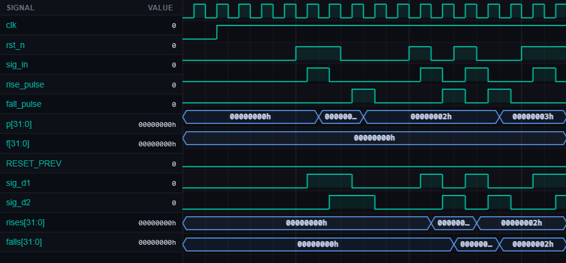

# [misc1] Six domains. One interview-ready workflow.

| Property | Value |
|----------|-------|
| **Language** | SystemVerilog |
| **Solved** | May 1, 2026 |
| **Platform** | [LeetSilicon](https://leetsilicon.com/?view=question&question=misc1) |

## Problem Description

Verilatorscale 1psend 170100%WaveformConsoleSignalValueclk0rst_n0sig_in0rise_pulse0fall_pulse0p[31:0][31:0]h00000000hf[31:0][31:0]h00000000hRESET_PREV0sig_d10sig_d20rises[31:0][31:0]h00000000hfalls[31:0][31:0]h00000000h
        @keyframes wv-spin { to { transform: rotate(360deg); } }
        .wv-sig-list { scrollbar-width: thin; scrollbar-color: #2a3140 transparent; }
        .wv-sig-list::-webkit-scrollbar { width: 8px; }
        .wv-sig-list::-webkit-scrollbar-track { background: transparent; }
        .wv-sig-list::-webkit-scrollbar-thumb { background: #1f2530; border-radius: 4px; }
        .wv-sig-list::-webkit-scrollbar-thumb:hover { background: #2a3140; }

## Simulation Results

| Metric | Value |
|--------|-------|
| **Status** | ✅ Passed |
| **Tests** | 4 passed, 0 failed |
| **Lint Warnings** | 0 |

## Waveforms

---
*Auto-synced by [SiliconHub](https://github.com) · May 1, 2026*
