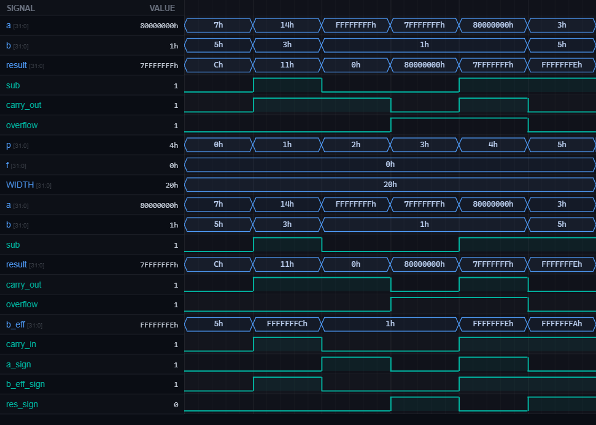

# [arith1] 18. Design Parameterizable N-bit Adder/Subtractor with Overflow Detection

| Property | Value |
|----------|-------|
| **Language** | SystemVerilog |
| **Solved** | April 12, 2026 |
| **Platform** | [LeetSilicon](https://leetsilicon.com/?view=question&question=arith1) |

## Problem Description

VerilatorBETA

WaveformConsole

Files ready — click Run to simulate.

@keyframes spin { to { transform: rotate(360deg); } }

Med.ArithmeticAdderDesign

### Problem Statement

Implement a combinational adder/subtractor with optional overflow and carry flags.

Operation:

```text
sub=0: result = A + B
sub=1: result = A + ~B + 1 (two's complement)
```

### Constraints:

•Parameterizable WIDTH

•Signed overflow: (A_sign == B_sign) && (A_sign != result_sign)

•Carry/borrow flag from MSB addition

### Requirements

- PARAMETERIZATION: Parameter WIDTH defines operand width (N bits).

- OPERATION CONTROL: Input "sub" (1 bit). sub=0: perform addition (A+B). sub=1: perform subtraction (A-B).

- ADDITION: result = A + B. Straightforward addition.

- SUBTRACTION: Implement using two's complement. result = A + (~B + 1) = A + (~B) + carry_in. Set carry_in=1 for subtraction.

- OUTPUTS: (1) result (WIDTH bits): sum or difference, (2) Optional: carry_out (1 bit): carry from MSB addition, (3) Optional: overflow (1 bit): signed overflow detection.

- CARRY/BORROW: For addition: carry_out is carry from MSB. For subtraction: carry_out interpretation as borrow (inverted logic). Document meaning.

- SIGNED OVERFLOW: Overflow occurs for signed operations when: (1) Adding two positive numbers yields negative result, (2) Adding two negative numbers yields positive result. Overflow formula: overflow = (A_sign == B_sign) && (A_sign != result_sign).

- UNSIGNED OVERFLOW: Detected by carry_out. For addition: overflow if carry_out=1. For subtraction: underflow if carry_out=0 (borrow occurred).

- Test Case 1 - Addition: WIDTH=8, A=10 (0x0A), B=3 (0x03), sub=0. Expected: result=13 (0x0D), carry_out=0 (no carry).

- Test Case 2 - Subtraction: WIDTH=8, A=10 (0x0A), B=3 (0x03), sub=1. Expected: result=7 (0x07), carry_out=1 (no borrow in unsigned).

- Test Case 3 - Signed Overflow Addition: WIDTH=8 (signed range -128 to +127), A=127 (0x7F), B=1 (0x01), sub=0. Expected: result=128 (0x80, wraps to -128), overflow=1.

- Test Case 4 - Signed Overflow Subtraction: WIDTH=8, A=-128 (0x80), B=1 (0x01), sub=1. Expected: result=-129 (wraps to +127, 0x7F), overflow=1.

- Test Case 5 - No Overflow: WIDTH=8, A=50 (0x32), B=20 (0x14), sub=0. Expected: result=70 (0x46), overflow=0, carry_out=0.

## Simulation Results

| Metric | Value |
|--------|-------|
| **Status** | ✅ Passed |
| **Tests** | 6 passed, 0 failed |
| **Lint Warnings** | 0 |

## Waveforms



---
*Auto-synced by [SiliconHub](https://github.com) · April 12, 2026*
