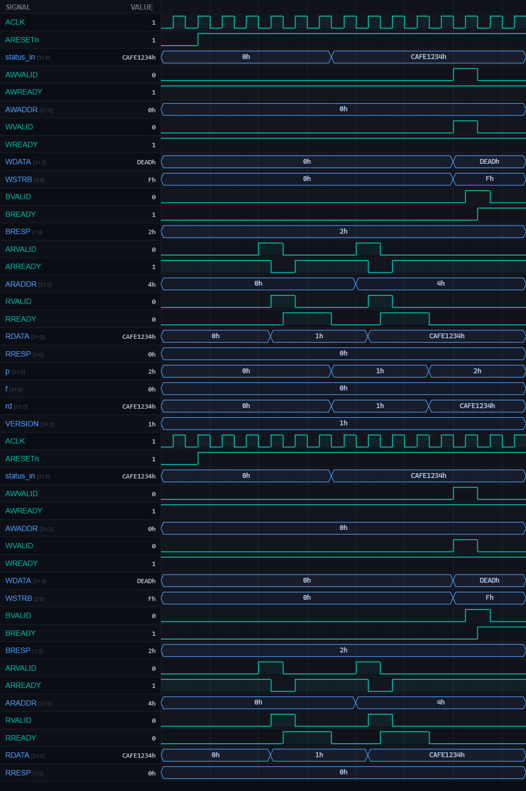

# [bus6] 26. Build AXI-Lite Read-Only Status Block

| Property | Value |
|----------|-------|
| **Language** | SystemVerilog |
| **Solved** | April 9, 2026 |
| **Platform** | [LeetSilicon](https://leetsilicon.com/?view=question&question=bus6) |

## Problem Description

### Problem Statement

Implement a read-only AXI-Lite peripheral exposing version and status registers.

Register map:

```text
0x00: version (hardcoded constant)
0x04: status  (driven from input)
Any write → error response
```

### Constraints:

•Reads return register contents

•Writes always return error on B channel

•Version is constant, status from input port

### Requirements

- REGISTER MAP: 0x00 = version register, 0x04 = status register.

- READ-ONLY DESIGN: Reads from valid addresses return register contents.

- WRITE ERROR: Any write attempt should generate an error response on B channel.

- AXI-LITE HANDSHAKE: Implement proper VALID/READY protocol for all channels.

- CONSTANT VERSION: Version register can be hardcoded to a constant value.

- STATUS INPUT: Status register may be driven from an input signal.

- RESET: Deassert response valid signals on reset.

- Test Case 1 - Read Version: Read 0x00. Expected: fixed version value returned.

- Test Case 2 - Read Status: Read 0x04. Expected: current status value returned.

- Test Case 3 - Write Attempt: Write to 0x00. Expected: BRESP indicates error.

- Test Case 4 - Invalid Read: Read 0x08. Expected: error or zero based on design choice.

- Test Case 5 - Backpressure: Hold RREADY low after read response. Expected: RVALID stays high until accepted.

## Simulation Results

| Metric | Value |
|--------|-------|
| **Status** | ✅ Passed |
| **Tests** | 3 passed, 0 failed |
| **Lint Warnings** | 0 |

## Waveforms



---
*Auto-synced by [SiliconHub](https://github.com) · April 9, 2026*
