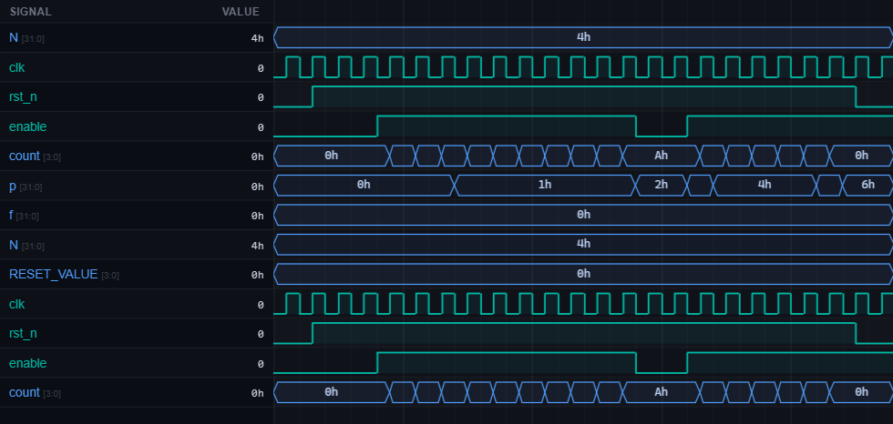

# [counter1] 11. Design N-bit Synchronous Counter with Enable and Reset

| Property | Value |
|----------|-------|
| **Language** | SystemVerilog |
| **Solved** | April 1, 2026 |
| **Platform** | [LeetSilicon](https://leetsilicon.com/?view=question&question=counter1) |

## Problem Description

### Problem Statement

Implement a parameterizable N-bit up counter with enable and reset.

### Behavior:

```text
enable=1 → count increments each cycle
enable=0 → count holds
Wraps from 2^N-1 to 0 automatically
```

### Constraints:

•Parameterizable N (counter width)

•Synchronous or asynchronous reset (document choice)

•Modulo 2^N wraparound

### Requirements

- PARAMETERIZATION: Parameter N defines counter width (number of bits). Counter range: 0 to 2^N - 1.

- ENABLE CONTROL: Input signal "enable". When enable=1, counter increments on rising clock edge. When enable=0, counter holds current value.

- INCREMENT: Counter increments by 1 each enabled clock cycle: count <= count + 1.

- WRAPAROUND: When counter reaches maximum value (2^N - 1) and increments, wraps to 0 naturally (modulo 2^N arithmetic).

- RESET: Define reset type (synchronous or asynchronous). On reset assertion, counter initializes to 0 (or parameterizable RESET_VALUE).

- OUTPUT: Counter value "count" (N bits).

- Test Case 1 - Counting with Enable: N=4 (4-bit counter, range 0-15). Assert enable=1. After 3 clock cycles, count=3. After 10 cycles total, count=10.

- Test Case 2 - Hold on Disable: Count at value 5. Deassert enable (enable=0) for 2 cycles. Expected: count remains 5. Re-enable, count increments to 6.

- Test Case 3 - Wraparound: N=4. Count at 15 (0xF, maximum). Enable=1. Next cycle: count wraps to 0.

- Test Case 4 - Reset: Count at arbitrary value (e.g., 7). Assert reset. Expected: count becomes 0 (or RESET_VALUE). Release reset and enable, counting resumes from 0.

- Test Case 5 - Continuous Counting: Enable always high. Observe count sequence: 0,1,2,3,...,15,0,1,... for N=4.

## Simulation Results

| Metric | Value |
|--------|-------|
| **Status** | ✅ Passed |
| **Tests** | 7 passed, 0 failed |
| **Max Cycles** | 10 |
| **Lint Warnings** | 0 |

## Waveforms



---
*Auto-synced by [SiliconHub](https://github.com) · April 1, 2026*
