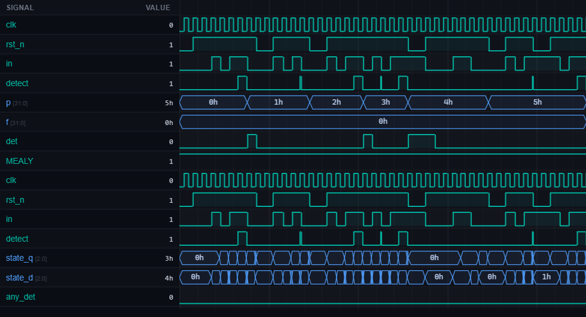

# [fsm1] 4. Design Overlapping Sequence Detector for Pattern 1011

| Property | Value |
|----------|-------|
| **Language** | SystemVerilog |
| **Solved** | April 1, 2026 |
| **Platform** | [LeetSilicon](https://leetsilicon.com/?view=question&question=fsm1) |

## Problem Description

Med.FSMSequence DetectionDesign

### Problem Statement

Implement an FSM to detect binary sequence "1011" in a serial input stream with overlapping support.

Example:

```text
Input:  0 1 0 1 1 0 1 0 1 1
Detect: _ _ _ _ ^ _ _ _ _ ^
```

### Constraints:

•Support overlapping detection

•Moore or Mealy (document choice)

•All states must have transitions for both in=0 and in=1

### Requirements

- PATTERN: Detect binary sequence "1011" (four bits).

- OVERLAPPING SUPPORT: After detecting "1011", immediately continue looking for the next occurrence starting from the longest valid suffix. Example: input "1011011" should detect two matches (positions ending at bits 3 and 6).

- FSM TYPE: Can implement as Moore (output depends only on state) or Mealy (output depends on state and input). Document choice. For Mealy: detect pulse on transition. For Moore: detect asserted in detection state.

- INPUT: Serial input signal "in" (1 bit per clock cycle).

- OUTPUT: Detection signal "detect" (1-bit pulse or level depending on Moore/Mealy).

- RESET: Synchronous or asynchronous reset (document choice). On reset, FSM returns to initial state IDLE, detect=0.

- STATE ENCODING: Define states clearly. Example states: IDLE (no match), S1 (seen "1"), S10 (seen "10"), S101 (seen "101"), S1011 (complete match).

- COMPLETE TRANSITIONS: Every state must have defined transitions for in=0 and in=1. No incomplete state diagrams (prevents latches).

- Test Case 1 - Single Match: Input sequence: 0 1 0 1 1 0. Expected: detect pulses (or asserts) at cycle 4 when "1011" completes.

- Test Case 2 - Overlapping Sequences: Input: 1 0 1 1 1. After first "1011" at bit 3, bit 4 (another "1") should create potential for overlap. However, "10111" contains "1011" followed by "1", not another complete "1011". Verify detect pulse occurs exactly once at correct position.

- Test Case 3 - Multiple Non-Overlapping Matches: Input: 1 0 1 1 0 1 0 1 1. Expected: detect pulses at two positions (after 4th and 9th bits).

- Test Case 4 - No Match: Input: 0 0 0 1 1 0 0 (no "1011"). Expected: detect never asserts.

- Test Case 5 - Reset During Sequence: Input "1 0 1", then assert reset. Expected: FSM returns to IDLE, detect=0. Continue with "1 0 1 1". Expected: detect pulses at completion.

- Test Case 6 - Fallback Transitions: Input "1 0 1 0" (breaks sequence at 4th bit). Expected: FSM falls back to appropriate state (S10) and continues looking.

## Simulation Results

| Metric | Value |
|--------|-------|
| **Status** | ✅ Passed |
| **Tests** | 6 passed, 0 failed |
| **Lint Warnings** | 0 |

## Waveforms



---
*Auto-synced by [SiliconHub](https://github.com) · April 1, 2026*
