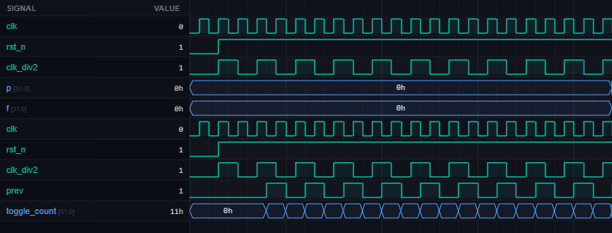

# [rtl10] 38. Divide-by-2 Clock Divider

| Property | Value |
|----------|-------|
| **Language** | SystemVerilog |
| **Solved** | April 5, 2026 |
| **Platform** | [LeetSilicon](https://leetsilicon.com/?view=question&question=rtl10) |

## Problem Description

### Problem Statement

Implement divide-by-2 clock using a toggling flip-flop.

### Constraints:

•Output toggles on each rising edge of clk

•50% duty cycle

•Define initial state on reset

### Requirements

- INPUTS: clk, rst_n.

- OUTPUT: clk_div2.

- TOGGLE: clk_div2 toggles on each rising edge of clk.

- RESET: Define initial output state.

- Test Case - Frequency: output frequency is clk/2.

- Test Case - Reset: after reset, clk_div2 returns to the documented initial state before toggling resumes.

## Simulation Results

| Metric | Value |
|--------|-------|
| **Status** | ✅ Passed |
| **Tests** | 1 passed, 0 failed |
| **Lint Warnings** | 0 |

## Waveforms

---
*Auto-synced by [SiliconHub](https://github.com) · April 5, 2026*
