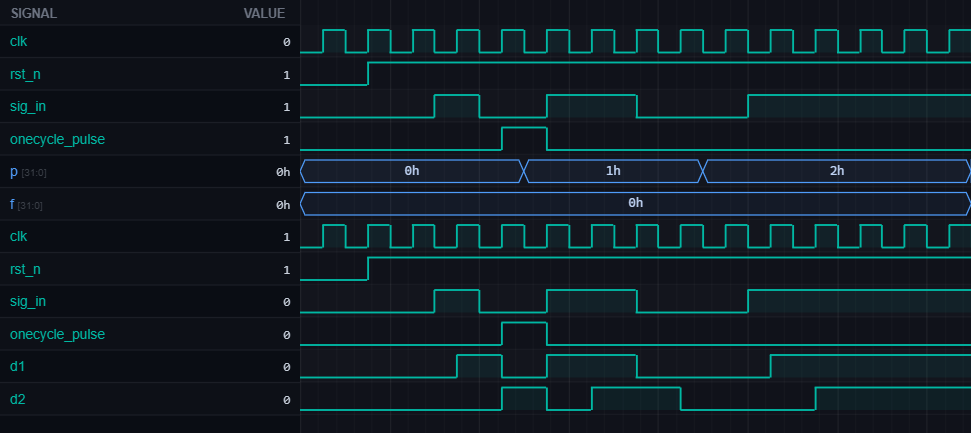

# [rtl2] 30. Detect a One-Cycle High Pulse (0→1→0)

| Property | Value |
|----------|-------|
| **Language** | SystemVerilog |
| **Solved** | April 14, 2026 |
| **Platform** | [LeetSilicon](https://leetsilicon.com/?view=question&question=rtl2) |

## Problem Description

VerilatorBETA

WaveformConsole

Files ready — click Run to simulate.

@keyframes spin { to { transform: rotate(360deg); } }

### Problem Statement

Assert output when input is high for exactly one clock cycle (pattern 0,1,0 in consecutive samples).

### Constraints:

•Keep 2-cycle history

•Two-cycle high (0,1,1,0) does NOT trigger

### Requirements

- INPUTS: clk, rst_n (optional), sig_in.

- OUTPUT: onecycle_pulse.

- HISTORY: Keep 2-cycle history using two registers.

- DETECT: Assert onecycle_pulse for 1 cycle when pattern 0,1,0 is observed in consecutive samples.

- Test Case - Valid: ...0,1,0... triggers onecycle_pulse once.

- Test Case - Two-cycle high: ...0,1,1,0... does not trigger.

- Test Case - Stuck high: ...1,1,1... does not trigger.

## Simulation Results

| Metric | Value |
|--------|-------|
| **Status** | ✅ Passed |
| **Tests** | 3 passed, 0 failed |
| **Lint Warnings** | 0 |

## Waveforms

---
*Auto-synced by [SiliconHub](https://github.com) · April 14, 2026*
