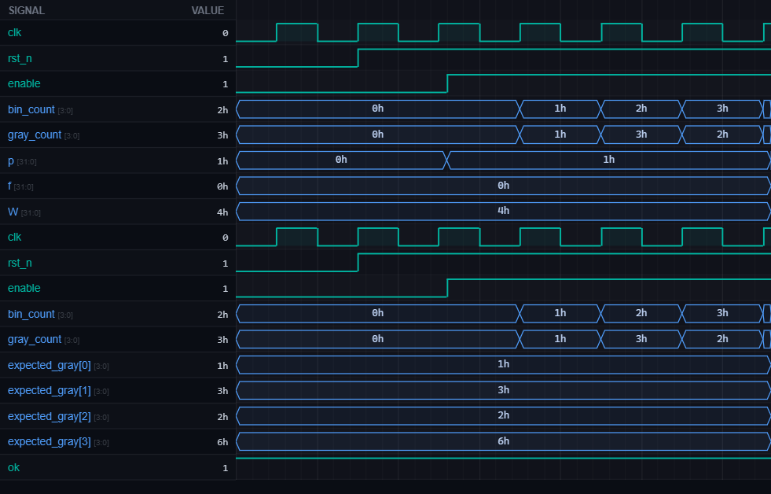

# [rtl6] 7. Majority Element

| Property | Value |
|----------|-------|
| **Language** | SystemVerilog |
| **Solved** | April 4, 2026 |
| **Platform** | [LeetSilicon](https://leetsilicon.com/?view=question&question=rtl6) |

## Problem Description

### Problem Statement

Given an array nums of size n, return the majority element.

The majority element is the element that appears more than ⌊n / 2⌋ times. You may assume that the majority element always exists in the array.

Example 1:

```text
Input: nums = [2,2,1,1,1,2,2]
Output: 2
```

Example 2:

```text
Input: nums = [3,3,4,3]
Output: 3
```

### Constraints:

•n == nums.length

•1 <= n <= 5 * 10⁴

•The majority element is guaranteed to exist

### Requirements

- Time complexity: O(n)

- Space complexity: O(1)

- Use Boyer-Moore Voting Algorithm

## Simulation Results

| Metric | Value |
|--------|-------|
| **Status** | ✅ Passed |
| **Tests** | 2 passed, 0 failed |
| **Lint Warnings** | 0 |

## Waveforms



---
*Auto-synced by [SiliconHub](https://github.com) · April 4, 2026*
