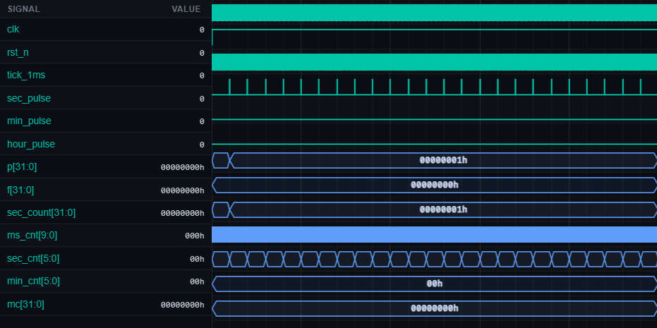

# [rtl9] rtl9

| Property | Value |
|----------|-------|
| **Language** | SystemVerilog |
| **Solved** | April 28, 2026 |
| **Platform** | [LeetSilicon](https://leetsilicon.com/?view=question&question=rtl9) |

## Simulation Results

| Metric | Value |
|--------|-------|
| **Status** | ✅ Passed |
| **Lint Warnings** | 0 |

## Waveforms

---
*Auto-synced by [SiliconHub](https://github.com) · April 28, 2026*
